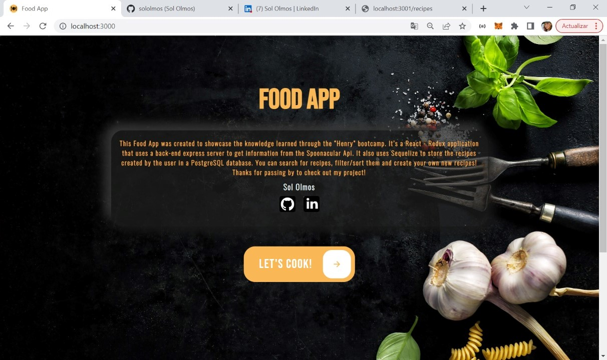

<p >
    
</p>

# Individual Project - FOOD APP 

## Objectives
```
> Build an App using React, Redux, Node and Sequelize.
> To affirm and connect the concepts acquired during the course.
> Learn best practices.
> Learn and practice Git/GitHub workflow.
```

## Tools used:
### Back-End:
- Node.js
- Express
- Sequelize / PostgresSQL

### Front-End:
- React.js
- Redux
- Styled components

### Deploy:
- Heroku
- Vercel

## About the project
- PERN stack application using [spoonacular](https://spoonacular.com/food-api) API and a local database to display 9 recipes per page. Also you can search recipes by name, filter them by type of diet, order alphabetically and by health score and create your own recipes.


 <br/>
<h3 align = "center" >Landing page </h3>
<br/>
<p>
 
</p>


 <br/>
<h3 align = "center" >Home, Search, filter and order recipes</h3>
<br/>
 

 <br/>
<h3 align = "center" >Details of recipes</h3>
<br/>
 

 <br/>
<h3 align = "center" >Form to create your own recipe</h3>
<br/> 


 <br/>
<h3 align = "center" > Your own recipe created</h3>
<br/>


 <br/>
<h3 align = "center" >View detail of recipe created </h3>
<br/> 


## Quick Start:
- Clone repository
- Run the next commands in project console: npm install -> npm start -> Open http://localhost:3000 in your browser
